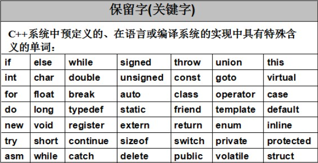
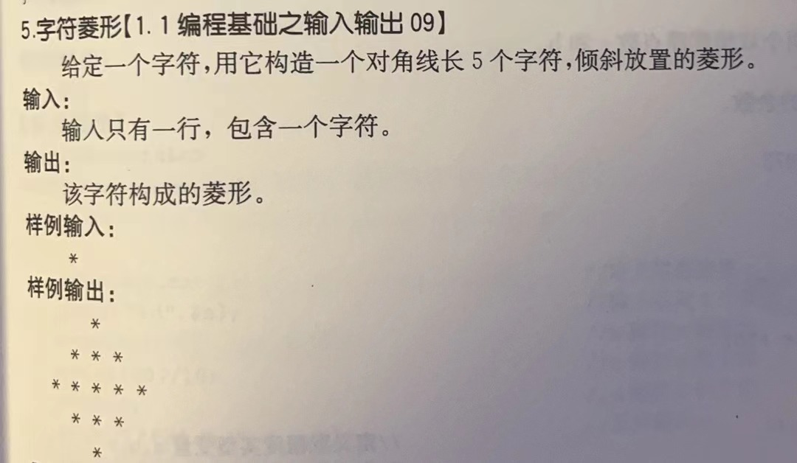
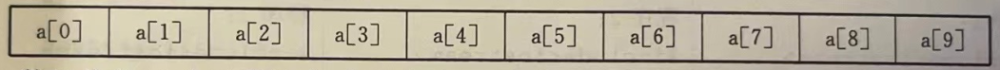
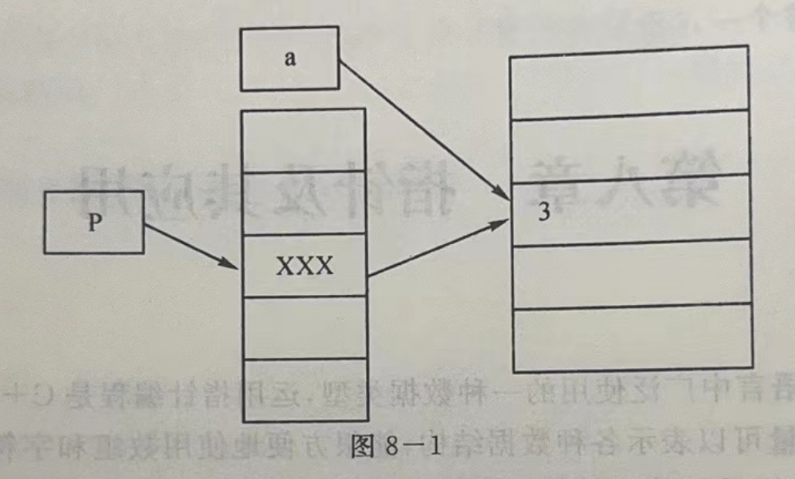
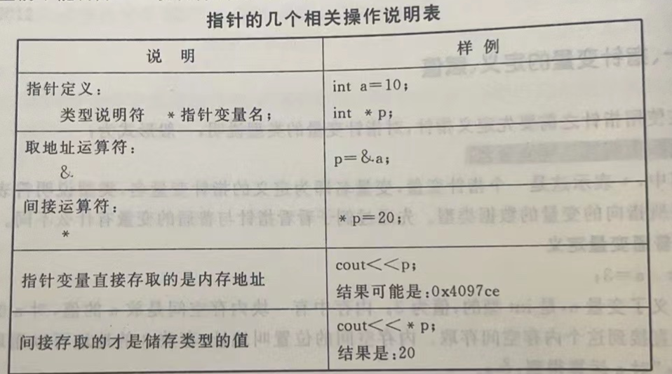
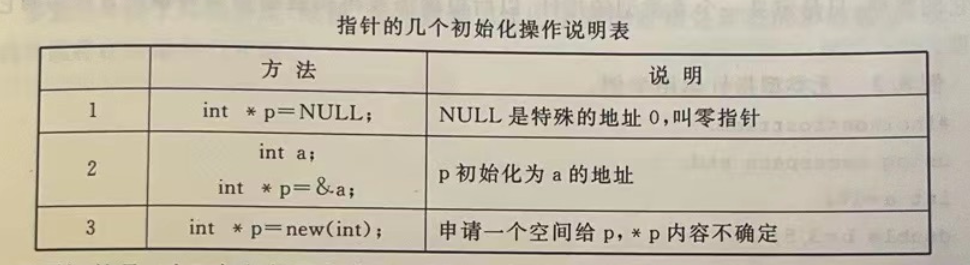
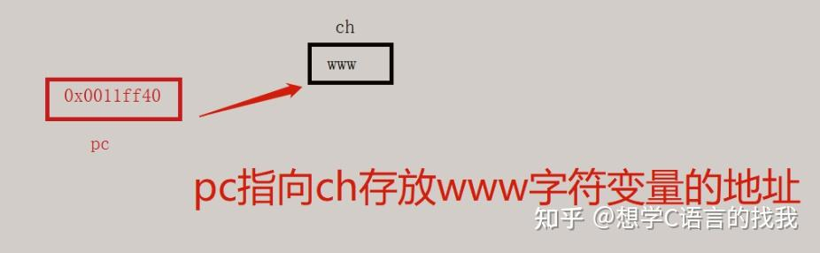
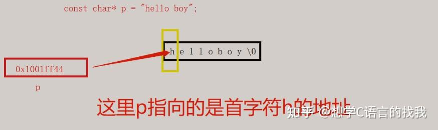

# 一. C++ 初识


## 1. 第一个 c++ 程序、注释

Hello world 程序

1.1_hello_world.cpp

```c++
// 导入基础库用于打印
#include <iostream>

// 程序开头 花括号两边代表着头和尾
int main(){
    // 打印 hello world
    std::cout << "Hello, World." << "\n";
}
```

## 2. 函数，变量

函数3要素：函数名和类型 ，参数 ，返回值

变量需要先申明再使用

1.2_functions_and_variables.cpp

```c++
// 标准库
#include <iostream>

// 定义正方形求面积函数，参数是宽：weight 高：height
int square_area(int weight, int height){
    return weight * height;
}

int main(){
    // 申明整数类型变量 area
    int area;
    // 调用正方形求面积函数，并将返回赋给 area
    area = square_area(3, 4);
    // 打印正方形面积
    std::cout << "Square area is:" << area;
    return 0;
}
```

变量 a =3 , 变量b = 4,只能用3个变量，将变量a和b的值互换。

```c++
#include <iostream>
int main(){
    int a = 3;
    int b = 4;
    
    std::cout << "a is:" << a ;
    std::cout << "b is:" << b ;
}
```


练习

**定义一个求平方函数，需要一个参数。在main 函数里面调用并填入参数 3 ，**

**要求打印的结果：The result of 3 ^ 2 is: 9. **

## 3. 常量

常量特点: 不可更改，必须在声明的时候赋值

在声明前面加 const或者**constexpr**，一般直接用**constexpr**

1.3_constant.cpp

```c++
// 标准库
#include <iostream>

// 程序开始
int main(){
    // 定义常量 value 的值mei为5
    constexpr float PI = 3.14;
    
    //PI = 3.15;

    // 打印常量
    std::cout << value;
}
```

## 4. 关键字

关键字不能作为变量名，常量名。一般不需要记住，避免命名的时候和关键字重复。需要平时设置变量名的时候尽可能多的长度。



[C++ 的关键字（保留字）完整介绍 | 菜鸟教程 (runoob.com)](https://www.runoob.com/w3cnote/cpp-keyword-intro.html)

## 5. 标识符命令规范

C++标识符的命名规则：

1. 标识符用字母A-Z,a-z,数字0-9和下划线_构成；_
2.  以字母（大小写）或者下划线_开头，开头不可以使用数字；
3.  不能用关键词
4.  不允许出现标点字符，比如 @、& 和 %。

将下列错误代码改正过来

```c++
// 标准库
#include iostream
 

// 定义正方形求面积函数，参数是宽：weight 高：height
int square_area(int weight, float height)
{
    return weight * height;
}

int main()
{
    // 定义整数类型变量 area
    int throw
    constexpr int area;
    // 调用正方形求面积函数，并将返回赋给 area
    area = square_area(3, 4)
    // 打印正方形面积
    std::cout << "Square area is:" << area << throw;

}
```

## 6.  命令空间

您可以使用 **using namespace** 指令，这样在使用命名空间时就可以不用在前面加上命名空间的名称。

命令空间还可以区分同名函数。

1.6_name_space.cpp

```c++
#include <iostream>

using namespace std;

int main(){
	
    cout << "Hello, World." << "\n";
}
```

## 7. 用户的输入 cin

cin 接受用户的输入，和 cout结合，可向显示器屏幕输出数据

格式1

```
int 变量;
cin >> 变量；
```

功能：从键盘读取一个数据并将其赋值给“变量”

格式2：

```
cin >> 变量1 >> 变量2 >> 变量3;
```

接受多个键盘输入，要求从键盘输入的数据的个数、类型与变量相一致。各个数据输入要有分割符，可以是一个或者多个空格。

练习1：



## 8. cout 流输出数据

流插人运算符 << 和 cout 结合在一起使用,可向显示器屏幕输出数据。

格式1

```
cout << 表达式;
```

功能:它把表达式的值输出到屏幕上,该表达式可以是各种基本类型的常量、变量或者由它们组成的表达式。输出时,程序根据表达式的类型和数值大小,采用不同的默认格式输出,大多数情况下可满足要求。若要输出多个数据,可以连续使用流插人运算符。

格式2:

```
cout<<表达式 1<<表达式 2<<表达式 3··.;
```

功能:将表达式的内容一项接一项的输出到屏幕上。

## 9. 字符输入函数 getchar

getchar 函数是接收从键盘输人的单个字符数据。它是一个无参函数，其语法格式为:

```
getchar();
```

[说明]

(1)通常把输人的字符赋予一个字符变量,构成赋值语句。例如:

```
char ch;
ch=getchar();
```

(2) getchar 函数只能接受单个字符,输人数字也按字符处理

(3)输人多于一个字符时,只接收第一个字符。

(4) getchar 函数等待用户输人,直到按回车键才结束,可用于暂停程序的运行,直到输人一个回车键。

(5)如果在程序中连续有两个以上 getchar()函数,应该一次性输入所需字符，最后再按回车键,否则会把回车作为一个字符传给后面的 getchar()函数。

用例

```c++
#include<cstdio>
#include<iostream>
using namespace std;
int main()
{
    char ch=getchar(); //读人字符
    cout << "input=" << ch << endl;
}
```

## 10. 字符输出函数 putchar

putchar 函数是字符输出函数,功能是向标准输出设备(如显示器)输出单个字符数据,其语法格式为:

```
putchar(ch); //其中,ch 为一个字符变量或常量。
```

用例：

```c++
#include<cstdio>
int main()
{
	char c='B';
    putchar(c);
}
```

## 11.  格式化输入函数 scanf 

scanf 函数的功能是格式化输人任意数据列表,其一般调用格式为:

```
scanf(格式控制符，地址列表)
```

[说明]
(1)地址列表中给出各变量的地址,可以是变量的地址,也可以是字符串的首地址，

(2)格式控制符由%和格式符组成,作用是将要输人的字符按指定的格式输人,如%d%c等。

scanf 函数的格式符

| 格式名  | 说明                                                    |
| ------- | ------------------------------------------------------- |
| d , i   | 用于输人十进制整数                                      |
| u       | 以无符号十进制形式输入十进制整数                        |
| o(字母) | 用于输人八进制整数                                      |
| x       | 用于输人十六进制整数                                    |
| c       | 用于输人单个字符                                        |
| s       | 用于输人字符串(非空格开始,空格结束,字符串变量以\0 结尾) |
| f       | 用于输人实数(小数或指数均可)                            |
| e       | 与f相同(可与f互换)                                      |

scanf_printf_test

```c++
#include <cstdio>

int main()
{
	char a[];
    int b;
    
    printf("Your name is:");
    scanf("%s", &a);
    
    printf("Your age is:");
    scanf("%d", &b);
    
	printf("My name is %s, My age is %d", a, b);
}
```

```python
print("{}{}".format(a,b)
```

## 12. 格式化输出函数 printf

printf 函数的功能是格式化输出任意数据列表，其一般调用格式为:

```
printf(格式控制符,输出列表)
```

说明
(1)格式控制由输人格式说明和普通字符组成，必须用双引号括起来。

1 格式说明由%和格式字符组成,作用是将要输出的字符转换为指定的格式,如%d,%c等。
2 普通字符是在输出时原样输出的字符，一般在显示时起提示作用。

(2)输出列表是需要输出的一组数据(可以为表达式和变量),各参数之间用“,”分开.

要求格式说明和各输出项在数量和类型上要一一对应，否则将会出现意想不到的错误

printf 函数的格式符

| 格式符  | 说明                                                |
| ------- | --------------------------------------------------- |
| d(或i)  | 以带符号的十进制形式输出整数，正数的(+)号省略不输出 |
| u       | 以无符号十进制形式输出整数                          |
| x(或X)  | 以十六进制无符号形式输出整数(不输出前导符 0x)       |
| o(字母) | 以八进制无符号形式输出整数(不输出前导符数字 0)      |
| c       | 输出一个字符                                        |
| s       | 输出字符串                                          |
| f       | 以小数形式输出单、双精度,隐含输出 6 位小数          |
| e(或E)  | 以指数形式输出单、双精度,隐含输出6 位小数           |
| g(或 G) | 自动选用%、%e或%E格式中输出宽度较小的一种使用       |

d格式符

| 参数       | 说明                                                   |
| ---------- | ------------------------------------------------------ |
| %d         | 输出数字长为变量数值的实际长度                         |
| %md        | 输出 m 位(不足补空格,大于 m 位时按实际长度输出)        |
| %-md       | m 含义同上。左对齐输出                                 |
| %ld        | I(小写字母)表示输出“长整型”数据                        |
| %mld       | 指定长整型输出宽度 m 位,左边补空格;否则,按实际位数输出 |
| %0md,%0mld | 0(数字 0)表示位数不足 m 时补0                          |

例如,对如下程序段

```
int i=l;
long j=123;
printf("%d,%2d,%03d,%ld,%-4ld,%05ld",i,i,i,j,j,j);
```

输出:1,_1,001,123,123 ,00123

f格式符

| 参数   | 说明                                            |
| ------ | ----------------------------------------------- |
| %f     | 按实数格式输出,整数部分按实际位数输出，6 位小数 |
| % m.nf | 总位数 m(含小数点),其中有 n位小数               |
| %-m,nf | 同上,左对齐`                                    |

s 格式符

| 参数   | 说明                                            |
| ------ | ----------------------------------------------- |
| %s     | 按实际宽度输出一个字符串                        |
| %ms    | m 指定宽度(不足时左补空格,大于时按实际宽度输出) |
| %-ms   | 左对齐,不足时右补空格                           |
| % m.ns | 输出占 m个字符位置，其中字符数最多 n个,左补空格 |
| %-m.ns | 同上,右补空格                                   |

# 二、 数据类型

C++语言提供了丰富的数据类型,本节介绍几种基本的数据类型:整型、实型、字符型它们都是系统定义的简单数据类型,称为标准数据类型.

| 基本的数据类型： |        |
| ---------------- | ------ |
| 整型             | int    |
| 浮点型           | float  |
| 双浮点型         | double |
| 字符型           | char   |
| 布尔型           | bool   |
| 无类型           | void   |

## 1.  整数类型 int （整型）

1G = 1024MB  1MB = 1024KB  1KB=1024B 1B=8bit

int 的范围是 -2147483648 到 2147483647 ，4个字节

**long int**  -9,223,372,036,854,775,808 到 9,223,372,036,854,775,807  , 8 字节   -2 31到2 31-1。

整数类型是指不带小数的数字

## 2. 浮点类型 float （实型）

 float 的范围 **-2^128 ~ +2^128** ，占4个字节

浮点类型一般用在带小数的数字

## 3. 双浮点型 double （实型）

double 的范围是 -2^1024 ~ +2^1024，占8个字节

一般情况用 double，因为一些编译器的缘故，用 double 会让数字更精确且不会出错。但在实际工作中应该按照需要设置是 float 或者 double，因为 double 的硬件开销会是 float 的两倍

## 4. 字符型 char

char 1 个字节，单字符

字符串：char site[] = "c++";

C++ 标准库提供了 **string** 类型，支持上述所有的操作，另外还增加了其他更多的功能。(补充了解)

```c++
#include <iostream>
using namespace std;
 
int main ()
{
    
   	char a = 'a';
    
    char site[4];
    site = "c++";
    
    char site[] = "c++";
    
    
   string str1 = "c++";
   cout <<  str1;
}
```

实际使用用下面这种方式就可以：

```c++
char site[] = "c++++++++";

char site[100];
site = "c+++++++++";

string site;
site = "c+++";
```


## 5. 布尔型 bool

布尔类型，存储值 true 或 false，占用 1 个字节。

​		创建方式：

```c++
bool flag = false; 
```

## 6. 无类型 void

一般用在没有返回值的函数里面

## 7. sizeof

用来打印数据类型的字节数，sizeof 里面打印

```c++
cout << sizeof(int);
```

## 8. typedef 声明

您可以使用 **typedef** 为一个已有的类型取一个新的名字。下面是使用 typedef 定义一个新类型的语法：

```c++
typedef type newname; 
```

例如，下面的语句会告诉编译器，int_string 是 int 的另一个名称：

```c++
typedef int intstring;
typedef char char_1;
```

sizeof 和 typedef 都是关键字

# 三、运算符

本章主要讲解以下几类运算符：

| 运算符类型 | 作用                         |
| ---------- | ---------------------------- |
| 算术运算符 | 四则运算                     |
| 赋值运算符 | 表达式的值赋给变量           |
| 比较运算符 | 用于比较，返回真值或者假值   |
| 逻辑运算符 | 根据表达式的值返回真值或假值 |

## 1. 算术运算符

作用：四则运算

包括以下符号：

假设 A 是 10， B 是 20

| 运算符 | 描述                                                         | 实例             |
| :----- | :----------------------------------------------------------- | :--------------- |
| +      | 把两个操作数相加                                             | A + B 将得到 30  |
| -      | 从第一个操作数中减去第二个操作数                             | A - B 将得到 -10 |
| *      | 把两个操作数相乘                                             | A * B 将得到 200 |
| /      | 分子除以分母                                                 | B / A 将得到 2   |
| %      | 取模运算符，整除后的余数                                     | B % A 将得到 0   |
| ++     | [自增运算符](https://www.runoob.com/cplusplus/cpp-increment-decrement-operators.html)，整数值增加 1 | A++ 将得到 11    |
| --     | [自减运算符](https://www.runoob.com/cplusplus/cpp-increment-decrement-operators.html)，整数值减少 1 | A-- 将得到 9     |

```c++
int i = 1;

printf("%d", i++);

printf("%d", ++i);

```


## 2. 赋值运算符

作用：用于将表达式的值赋给变量

包括以下符号：

| 运算符 | 术语   | 示例      | 结果 |
| ------ | ------ | --------- | ---- |
| =      | 赋值   | a=2;      |      |
| +=     | 加等于 | a=0;a+=2; |      |
| -=     | 减等于 | a=5;a-=3; |      |
| *=     | 乘等于 | a=2;a*=2; |      |
| /=     | 除等于 | a=4;a/=2; |      |
| %=     | 模等于 | a=3;a%2;  |      |

```c++
int a;
a = 2;

a = a + 2;
a += 2;

a = 5;
a = a % 2;
a %= 2;
```


## 3. 比较运算符

作用：用于表达式的比较，并返回一个真值或者假值

假设变量 A 的值为 10，变量 B 的值为 20，则：

| 运算符 | 描述                                                         | 实例              |
| :----- | :----------------------------------------------------------- | :---------------- |
| ==     | 检查两个操作数的值是否相等，如果相等则条件为真。             | (A == B) 不为真。 |
| !=     | 检查两个操作数的值是否相等，如果不相等则条件为真。           | (A != B) 为真。   |
| >      | 检查左操作数的值是否大于右操作数的值，如果是则条件为真。     | (A > B) 不为真。  |
| <      | 检查左操作数的值是否小于右操作数的值，如果是则条件为真。     | (A < B) 为真。    |
| >=     | 检查左操作数的值是否大于或等于右操作数的值，如果是则条件为真。 | (A >= B) 不为真。 |
| <=     | 检查左操作数的值是否小于或等于右操作数的值，如果是则条件为真。 | (A <= B) 为真。   |

```c++
#include <iostream>

using namespace std;

int main()
{

    int a = 3;
    int b = 4;
    int c = 3;
    bool d;

    // ==
    d = (a == b);
    cout << d << endl;

    // !=
    d = (a != b);
    cout << d << endl;
    
    // >
    d = (a > b);
    cout << d << endl;
	
    // <
    d = (a < b);
    cout << d << endl;
    
    // >= 
    d = (a >= b);
    cout << d << endl;
    
    // <=
    d = (a <= b);
    cout << d << endl; 
}
```


## 4. 逻辑运算符

作用： 用于根据表达式的值返回真值或者假值

| 运算符 | 描述                                                         | 实例                 |
| :----- | :----------------------------------------------------------- | :------------------- |
| &&     | 称为逻辑与运算符。如果两个操作数都 true，则条件为 true。     | (A && B) 为 false。  |
| \|\|   | 称为逻辑或运算符。如果两个操作数中有任意一个 true，则条件为 true。 | (A \|\| B) 为 true。 |
| !      | 称为逻辑非运算符。用来逆转操作数的逻辑状态，如果条件为 true 则逻辑非运算符将使其为 false。 | !(A && B) 为 true。  |

```
int a = 2;
int b = 1;
bool c;
c = !(a>b) && (a<0);

```

练习

算法题    难度：算法题中的简单题

先输入一个三位数，要求把这个数得百位数与个位数对调，输出对调后的数。


算法2： 给出一个等差数列的前两项a1,a2,求第n项是多少。

输入：

一行 包含3个整数 a1,a2,n(-100<=a1,a2<=100,0<n<1000)

输出：

一个整数，即第n项的值

样例输入：

1 4 100

输出：

288-


# 四、程序的控制结构

在 c++ 中，所有程序都可用 顺序结构，选择结构，循环结构

## 1、选择结构

## 1.1  if 语句（单分支结构）

格式 1：

if （条件句）

{

​		语句；

}

```c++
int a = 1;

if (a == 0)
{
	printf("a = 0 is ture");
}

```

例子：

输入一个整数 a ,如果 a 为偶数，输出 yes

## 1.2  if-else (双分支结构)

格式：

if （条件句）

{

​	语句；

}

else if （条件句）

 {

​	语句；

}

else

{

​	语句；

}

练习：

设 maxn 用于存放三个数中最大的数，输入的三个数存放在 a、b、c 中，那么如果 a 比 b 和 c 大，则最大数是a,否则，如果 b 比 a和 c 大，则最大数是 b ,否则，最大数就是c.      

## 1.3 三目运算符

c++ 有一个常用来代替if-else 语句的操作符，这个操作符被称为三目运算符（？：），它是 c++ 中唯一一个需要3个操作符的操作符。

b ? a:c

x=5>3?10:12

练习： 输入两个整数 ，判断哪个数字更大，输出更大的数字

```c++
#include<iostream>

using namespace std;

int main()
{
    int x=5>3?10:12;
    cout << x;
    return 0;
}
```


## 2. switch 语句

语句格式：

switch(表达式)

{

​	case 常量表达式1:

​                语句；

​				break;

​	case 常量表达式2:

​                语句；

​				break;

​	default:

​				语句；

}

```c++
#include <iostream>
using namespace std;
 
int main ()
{
   // 局部变量声明
   char grade = 'A';
 
   switch(grade)
   {
   case 'A' :
      cout << "很棒！" << endl; 
      break;
   case 'B' :
           cout << "很棒！" << endl; 
      break;
   case 'C' :
      cout << "做得好" << endl;
      break;
   case 'D' :
      cout << "您通过了" << endl;
      break;
   case 'F' :
      cout << "最好再试一下" << endl;
      break;
   default :
      cout << "无效的成绩" << endl;
   }
   cout << "您的成绩是 " << grade << endl;
 
   return 0;
}
```

练习： 输入数字 1-7，返回对应的星期几（英文），如果输入1-7以外的的数字，返回 "error input."


第8次课课前练习

1、 收集瓶盖赢大奖

某饮料公司最近推出了一个“收集瓶盖赢大奖”的活动:如果你拥有 10 个印有“幸运”或20 个印有“鼓励”的瓶盖,就可以兑换一个神秘大奖。现分别给出你拥有的印有“幸运”和“鼓励”的瓶盖数,判断是否可以去兑换大奖。若可以兑换大奖,输出 1,否则输出0

输入:

一行,包含两个整数,分别是印有“幸运”和“鼓励”的瓶盖数,用一个空格隔开输出:
一行。若可以兑换大奖,输出 1,否则输出 0。

样例输入:

11 19

样例输出:

1


2、  判断一个数能否被 3,5,7 整除

给定一个整数,判断它能否被 3,5,7 整除,并输出以下信息:

(1)能同时被 3,5,7 整除(直接输出 3 5 7,每个数中间一个空格);

(2)只能被其中两个数整除(输出两个数,小的在前,大的在后。例如:3 5 或者 37 或者5 7,中间用空格分隔);

(3)只能被其中一个数整除(输出这个除数);

(4)不能被任何数整除,输出小写字符“n”,不包括引号


3、 简单计算器（用 switch 语句写）

```
	一个最简单的计算器,支持十,一，*，/ 四种运算。仅需考虑输人输出为整数的情况，数据和运算结果不会超过 int 表示的范围。然而:
	(1)如果出现除数为0的情况，则输出:Divided by zero!;
	(2)如果出现无效的操作符(即不为十,一，*，/ 之一),则输出:Invalid operator!。
	输入:	
		一行,共有 3 个参数,其中第 12 个参数为整数,第 3 个参数为操作符(十，一，* ,/).
	输出:
		一行，一个整数,是运算结果。然而:
		(1)如果出现除数为 0的情况，则输出:Divided by zero!;
		(2)如果出现无效的操作符(即不为十,一，*，/ 之一),则输出:Invalid operator!。
	样例输入:
		1 2 +
	样例输出：
		3
```


# 五、循环结构

## 1. for 语句

格式1： 

​	for (控制变量初始化表达式；条件表达式；增量表达式)

​		语句1；

格式2：

​	for (控制变量初始化表达式；条件表达式；增量表达式)

​	{

​		 语句2；

​		 语句3;

​	}


for(int i=0;  i > 100;  i++)

{

​	语句1；

}

## 2. while 语句

格式1：

```c++
while (条件表达式)：
	语句1 ；
```

格式2：

```
while (条件表达式)
{
	语句1 ；
	语句2 ；
}
```

## 3. do - while 语句

格式1：

```
do
	语句1；
while （条件表达式）；
```

格式2：

```
do
{
	语句1；
	语句2；
}
while （条件表达式）；
```

# 六、数组

## 1. 一维数组

**定义**：当数组中每个元素只带有一个下标时,我们称这样的数组为一维数组

数组的定义格式如下:

类型标识符 数组名[常量表达式]

说明:

1. 数组名的命名规则与变量名的命名规则一致。
2. 常量表达式表示数组元素的个数。可以是常量和符号常量,但不能是变量

例如:

int a[10];  //数组a定义是合法的

int b[n];   //数组 b定义是非法的

其中,a 是一维数组的数组名,该数组有 10 个元素,依次表示为:a[0], a[1], a[2], a[3], a[4], a[5], a[6], a[7], a[8], a[9]。

需要注意的是 a[10] 不属于该数组的空间范围。当在说明部分定义了一个数组变量之后,C十十编译程序为所定义的数组在内存空间开辟一串连续的存储单元。

例如:上例中的 a 数组在内存的存储如下表所示:



**引用**:

通过给出的数组名称和这个元素在数组中的位置编号(即下标),程序可以引用这个数组中的任何一个元素。

一维数组元素的引用格式:

​		数组名[下标]

例如:若 ij都是 int 型变量,则:

​		a[5]

**初始化**:

数组的初始化可以在定义时一并完成。格式:

类型标识符数组名[常量表达式]={值 1,值 2,·}

例如:

```
#include<bits/stdc++.h>

using namespace std;

int main(){
    int input;
    int a[10] = {};
    for (int i = 0; i < 2; i++)
    {
        scanf("%d", &input);
        a[i] = input; 
    }

    for (int i = 0; i < 2; i++)
    {
        printf("%d\n", a[i]);
    }
}
```

说明:

(1)在初值列表中可以写出全部数组元素的值,也可以写出部分。例如，以下方式可以对数组进行初始化:

```
int x[10]={0,1,2,3,4};
```

该方法仅对数组的前 5 个元素依次进行初始化,其余值为 0

(2)对数组元素全部初始化为 0,可以简写为: {}。

例如:

```
int a[5]={}; //初始化5个值都为 0
```

**越界：**

C++语言规定，使用数组时,要注意:

(1)数组元素的下标值为非负整数。

(2)在定义元素个数的下标范围内使用。

然而,当在程序中把下标写成负数、大于数组元素的个数时,程序编译的时候是不会出错的。例如:

```；
int a[10];
a[20]=15;
a[10]=20;
int k=a[30]
```

这些语句的语法是正确的,能够通过程序的编译。然而,它们要访问的数组元素并不在数组的存储空间中,这种现象叫数组越界。


```
5 6 4 3 7

5 6 -》6 5
6 5 4 3 7

7 5 4 3 6


```


## 2. 二维数组

**定义**：

当一维数组元素的类型也是一维数组时,便构成了“数组的数组”,即二维数组。二维数组定义的一般格式:

数据类型 [数组名] [常量表达式 1] [常量表达式 2] ;

例如

```
int a[4][10];
```

a 数组实质上是一个有 4 行、10 列的表格,表格中可储存 40 个元素。第 1行第 1列对应 a数组的 **a[0][0**],第 n 行第 m 列对应数组元素 **a[n-1][m-1**]。
说明: 当定义的数组下标有多个时,我们称为多维数组,下标的个数并不局限在一个或两个,可以任意多个,如定义一个三维数组 a 和四维数组 b:

```
int a[100][3][5];
int b[100][100][3][5];
```

二维数组初始化：

```
int direct[2][2]={{1,0,6}, {2,1,4}}
```

多维的数组引用赋值等操作与二维数组类似。

## 3. 字符数组

一维字符数组

```c++
char a = 'a';
char list[6] = {'c', 'h’, ‘i’, ‘n’, ‘a’, '\0'};
char list[] = "china";
```

二维字符数组

```c++
char list2[3][4] = {"abc", "bdf", "ggg"};
```

### 3.1 字符串输入与输出

本节仅介绍将字符串作为一个整体进行输人和输出的语句。

a. 输入

从键盘输人一个字符数组可以使用 scanf 语或 gets 语句。

(1)scanf语句

格式:scanf("%s",  字符串名称);

说明:

1.这里的字符串名称之前不加&这个取地址符。例如:scanf("%s",&s1)是错误的。

2.系统会自动在输人的字符串常量后添加\0标志,因此输人时,仅输人字符串的内容

3.输入多个字符串时,以空格分隔。

例如:scanf("%s%s%s",s1,s2,s3);从键盘分别输人 Let us go,则三个字符串分别获取了三个单词。反过来可以想到,如果仅有一个输人字符串名称的情况下,字符串变量仅获取空格前的内容。

例如:scanf("%s",s1);从键盘分别输人 Let us go,则仅有第一个单词被获取，即 sl变量仅获取第一个单词 Let

(2)gets 语句

格式: gets(字符串名称);

说明:

使用 gets 只能输入一个字符串。

例如:gets(sl,s2);是错误的。使用 gets,是从光标开始的地方读到换行符也就是说读人的是一整行,而使用 scan 是从光标开始的地方到空格,如果这一行没有空格,才读到行尾。
例如:

```c++
scanf("%s",sl);

char s2[10];
gets(s2);
```

对于相同的输人 Hello World!。s1 获取的结果仅仅是 Hello,而 s2 获取的结果则是 Hello World!

### 3.2 输出

向屏幕输出一个字符串可以使用 printf 语或 puts 语句

(1)printf 语句

格式:printf("%s",字符串名称);

说明:

1.用%s 格式输出时,printf 的输出项只能是字符串(字符数组)名称,而不能是数组元素。例如:printf("%s",a[5]);是错误的。

2.输出字符串不包括字符串结束标志符 \0。

(2)puts 语句

格式:puts(字符串名称);

说明:puts 语句输出一个字符串和一个换行符。对于已经声明过的字符串 a,printf("%s\n",a)和 puts(a)是等价的。

### 3.3 字符串处理函数

头文件：

```c++
#include <string.h>
```

| 函数格式                             | 函数功能                                                     |
| ------------------------------------ | ------------------------------------------------------------ |
| asa(字符串名1,字符串名 2)            | 将字符串 2 连接到字符串 1后边，返回字符串 1的值。            |
| strncat(字符串名1,字符串名 2,长度 n) | 将字符串 2前n个字符连接到字符串 1后边，返回字符串1的值       |
| strcpy(字符串名1,字符串名 2)         | 将字符串 2复制到字符串 1,返回字符串1的值                     |
| strncpy(字符串名1,字符串名2,长度n)   | 将字符串 2前n个字符复制到字符串 1,返回字符串 1的值           |
| strcmp(字符串名1,字符串名2)          | 比较字符串 1和字符串 2的大小,比较的结果由函数带回如果字符串 1>字符串2,返回一个正整数;<br />如果字符串1=字符串 2,返回 0; <br />如果字符串 1<字符串 2,返回一个负整数 |
| strncmp(字符串名1,字符串名2，长度n)  | 比较字符串 1和字符串2的前n个字符进行比较，函数返回值得情况同 strcmp函数。 |
| strlen(字符串名)                     | 计算字符串的长度,终止符 0不算在长度之内。                    |
| strlwr(字符串名)                     | 将字符串中大写字母换成小写字母                               |
| strupr(字符串名)                     | 将字符串中小写字母换成大写字母                               |

# 七、函数

​		通常,在程序设计中,我们会发现一些程序段在程序的不同地方反复出现，此时可以将这些程序段作为相对独立的整体,用一个标识符给它起一个名字,凡是程序中出现该程序段的地方,只要简单地写上其标识符即可。这样的程序段,我们称之为子程序。

​		子程序的使用不仅缩短了程序,节省了内存空间及减少了程序的编译时间,而且有利于结构化程序设计。因为一个复杂的问题总可将其分解成若干个子问题来解决,如果子问题依然很复杂,还可以将它继续分解,直到每个子问题都是一个具有独立任务的模块。这样编制的程序结构清晰,逻辑关系明确,无论是编写、阅读、调试还是修改，都会带来极大的好处。

​		在一个程序中可以只有主程序而没有子程序(本章以前都是如此),但不能没有主程序也就是说不能单独执行子程序。

​		在此之前,我们曾经介绍并使用了 C++ 提供的各种标准函数，这些系统提供的函数为我们编写程序提供了很大的方便。

​		总结： 函数是为了帮助程序解决重复性的工作。比如说 cin 、cout , 会在程序中大量用到。

## 1、 函数的定义

函数定义的语法形式

```c++
数据类型 函数名(形式参数表)
{
	函数体 //执行语句
}
```

关于函数的定义有如下说明:

·函数的数据类型是函数的返回值类型(若数据类型为 void ,则无返回值)。

·函数名是标识符,一个程序中除了主函数名必须为 main 外,其余函数的名字按照标识符的取名规则可以任意选取,最好取有助于记忆的名字。

·形式参数(简称形参)表可以是空的(即无参函数),也可以有多个形参,形参间用逗号隔开,不管有无参数,函数名后的圆括号都必须有。形参必须有类型说明,形参可以是变量名、数组名或指针名,它的作用是实现主调函数与被调函数之间的关系。

·函数中最外层一对花括号“{}”括起来的若干个说明语句和执行语句组成了一个函数的函数体。由函数体内的语句决定该函数功能。函数体实际上是一个复合语句,它可以没有任何类型说明,而只有语句,也可以两者都没有,即空函数。

·函数不允许嵌套定义。在一个函数内定义另一个函数是非法的,但是允许嵌套使用。

函数在没有被调用的时候是静止的，此时的形参只是一个符号,它标志着在形参出现的位置应该有一个什么类型的数据。函数在被调用时才执行,也就是在被调用时才由主调函数将实际参数(简称实参)值赋予形参。这与数学中的函数概念相似,如数学函数:

```
f(x)=x^2+x+1
```

这样的函数只有当自变量被赋值以后,才能计算出函数的值。

函数定义的例子:

定义一个函数，返回两个数中的较大数。

```c++
int max(int x,int y)
{
	return x>y?x:y;
}
```

该函数返回值是整型,有两个整型的形参,用来接受实参传递的两个数据，函数体内的语句是求两个数中的较大者并将其返回主调函数。

函数的形式：

函数的形式从结构上说可以分为三种:无参函数、有参函数和空函数。它们的定义形式都相同。

(1)无参函数
无参函数顾名思义即为没有参数传递的函数,无参函数一般不需要带回函数值，所以函数类型说明为 void

(2)有参函数

有参函数即有参数传递的函数，一般需要带回函数值。例如int max(int x,int y)函数

(3)空函数

空函数即函数体只有一对花括号,花括号内没有任何语句的函数。例如，

```
void 函数名()
{

}
```

空函数不完成什么工作,只占据一个位置。在大型程序设计中,空函数用于扩充函数功能。

编写一个阶乘的函数,我们给此函数取一个名字js。

```c++
int js(int n)
{
	int s=1;
    for (int i=1;i<=n;++i)
    {
       s*=i; 
    }
    return s;
}
```

在本例中，函数名叫 js , 只有一个 int 型的自变量  n,函数 js 属 int 型。在本函数中,要用到两个变量 i,s。在函数体中,是一个求阶乘的语句,n 的阶乘的值在 s 中,最后由 return 语句将计算结果 s值带回,js()函数执行结束，在主函数中js()值就是 s 的值。

在这里,函数的参数 n是一个接口参数，说得更明确点是人口参数。如果我们调用函数:js(3),那么在程序里所有有 n的地方,n 被替代成3 来计算。在这里,3就被称为实参。

## 2、函数的声明和调用

函数的声明：

调用函数之前先要声明函数原型。在主调函数中或所有函数定义之前，按如下形式声明

```c++
类型说明符 被调函数名(含类型说明的形参表);
```

```c++
int js(int n);

int js(int n)
{
	return n;
}
```

函数的调用：

声明了函数原型之后,便可以按如下形式调用函数:

```
函数名(实参列表)
```

函数的返回值：

在组成函数体的各类语句中,值得注意的是返回语句 return。它的一般形式是

```
return (表达式);
```

## 3、函数的传值调用

传值调用：

这种调用方式是将实参的数据值传递给形参,即将实参值拷贝一个副本存放在被调用函数的栈区中。在被调用函数中,形参值可以改变,但不影响主调函数的实参值。参数传递方向只是从实参到形参,简称单向值传递。举个例子:

```c++
#include<iostream>
using namespace std;

void swap(int a,int b);

void swap(int a,int b)
{
	int tmp=a;
    a=b;
    b=tmp;
}
int main()
{
    int c=1,d=2;
    swap(c,d);
    cout<<c<<'.'<<d<<endl;
    
    return 0;
}

```

## 4、全局变量、局部变量、作用域

在函数外部定义的变量称为外部变量或全局变量,在函数内部定义的变量称为内部变量或局部变量。

**全局变量:**（不建议使用）

定义在函数外部没有被花括号括起来的变量称为全局变量,全局变量的作用域是从变量定义的位置开始到结束。

```c++
#include<iostream>
using namespacestd;
int x = 1;
float pi = 3.14;

int num(int y)
{
    return x+y;
}

int main()
{
    int a = 1;
    cout << num(x, y);
}
```

使用全局变量的说明:
· 在一个函数内部,既可以使用本函数定义的局部变量,也可以使用在此函数前定义的全局变量。
全局变量的作用是使得函数间多了一种传递信息的方式。如果在一个程序中多个函数都要对同一个变量进行处理,即共享,就可以将这个变量定义成全局变量,虽然使用非常方便，但副作用也不可低估。
· 过多地使用全局变量,会增加调试难度。因为多个函数都能改变全局变量的值,不易判断某个时刻全局变量的值。
· 过多地使用全局变量,会降低程序的通用性。如果将一个函数移植到另一个程序中,需要将全局变量一起移植过去,同时还有可能出现重名问题。
·全局变量在程序执行的全过程中一直占用内存单元全局变量在定义时若没有赋初值,其默认值为 0。

**局部变量:**

(1)局部变量的作用域是在定义该变量的函数内部。换句话说,局部变量只在定义它的函数内有效。函数的形参也是局部变量。局部变量的存储空间是临时分配的,当函数执行完毕，局部变量的空间就被释放,其中的值无法保留到下次使用。

(2)由于局部变量的作用域仅局限于本函数内部,所以,在不同的函数中变量名可以相同,它们分别代表不同的对象,在内存中占据不同的内存单元,互不干扰。

(3)一个局部变量和一个全局变量是可以重名的,在相同的作用域内局部变量有效时全局变量无效，即局部变量可以屏蔽全局变量。

(4)在代码块中定义的变量的存在时间和作用域将被限制在该代码块中。如 for(int i;i<=n;i++){sum+=i}中的i是在该 for 循环语中定义的,存在时间和作用域只能被限制在该 for 循环语句中。

(5)这里需要强调的是,主函数 main 中定义的变量也是局部变量,这一点与其他程序设计语言不同。

(6) 全局变量数组初始全部为 0,局部变量值是随机的,要初始化初值,局部变量受栈空间大小限制,大数组需要注意。通俗说,局部变量的数组不能开很大,全局变量随便。

## 5、 递归算法

f(x) = x^n

x^0 = 1

x^1 = x *  x^0

x^2 = x  * x^1

x^3 = x  *  x^2

```c++
int x;

int xn(int n)
{
	if (n==0)
    {
        return 1;
    }
	else   
    {
        return x*xn(n-1);
    }
}
int main(){
    int n;
    cin>>x>>n;
    cout<< xn(n) <<endl;
    return 0;
}
```

# 八、文件和结构体

​	文件是根据特定的目的而收集在一起的有关数据的集合。C++把每一个文件都看成是一个有序的字节流,每个文件都以文件结束标志结束。如果要操作某个文件,程序必须首先打开该文件。当一个文件被打开后,该文件就和一个流关联起来,这里的流实际上是一个字节序列。

## 1、文件操作

C++语言提供了一批用于文件操作的标准函数,它包含于标准库 cstdio 中,文件操作基本步骤如下：

(1)打开文件，将文件指针指向文件,决定打开文件类型;

(2)对文件进行读、写操作;

(3)在使用完文件后,关闭文件。

### freopen：

[命令格式]

```
FILE * freopen( const char * filename, const char * mode, FILE * stream);
```

[参数说明]

filename:要打开的文件名
mode:文件打开的模式,和 fopen 中的模式(r/w)相同
stream: 文件指针，通常使用标准流文件(stdin/stdout/stderr)
其中 stdin 是标准输人流,默认为键盘;stdout 是标准输出流，默认为屏幕;stderr 是标准错误流，一般把屏幕设为默认。通过调用 freopen,就可以修改标准流文件的默认值,实现重定向。

[使用方法]

接下来我们使用 freopen() 函数以只读方式 r(read)打开输入文件 slyar.in。

```
freopen("slyar_in.txt"，"r"，stdin);
```

然后使用 freopen()函数以写入方式 w(write)打开输出文件 slyar.out。

```
freopen("slyar_out.txt"，"w"，stdout);
```

最后只要使用 fclose 关闭输人文件和输出文件即可。

```
fclose(stdin);
fclose(stdout);
```

完整用例：

```c++
#include <cstdio>
int main(){
	freopen("slyar.in","r",stdin);
    freopen("slyar.out","w",stdout);
    fclose(stdin);
    fclose(stdout);
}
```

用例1：

从 in.txt 文件中读入数据,把它们的和保存 out.txt 文件中。

方式1

```c++
#include <cstdio>
int main()
{
    freopen("in.txt", "r", stdin);
    freopen("out.txt", "w", stdout);
    int temp, sum = 0;
    while (scanf("%d", &temp) == 1)
    {
        sum = sum + temp;
    }
    printf("%d\n", sum);
    fclose(stdin);
    fclose(stdout);
}
```

方式 2

```c++
#include <cstdio>
#include <iostream>

using namespace std;
int main()
{
    freopen("in.txt", "r", stdin);
    freopen("out.txt", "w", stdout);
    int temp, sum = 0;
    while (cin >> temp)
    {
        sum = sum + temp;
    }
    cout << sum;
    fclose(stdin);
    fclose(stdout);
}
```

### fopen:

freopen 用起来很方便,但并不是所有算法竞赛都允许读写文件。甚至有的竞赛允许访问文件,但不允许使用 freopen 这样的重定向方式读写文件,可以使用 fopen 版,对 scanf 和 printf 语句适用，修改如下：

```c++
#include<cstdio>
int main(){
    FILE *fin,*fout;
    fin=fopen("in.txt","rb");
    fout=fopen("out.txt","wb");
    int temp,sum=0;
    while (fscanf(fin,"%d",&temp) == 1)
    {
        sum=sum+temp;
    }
    fprintf(fout,"%d\n",sum);
    fclose(fin);
    fclose(fout);
}
```

先声明变量 fin 和 fout(暂且不用管 FILE * 为何物),把 scanf 改成 fscanf,第一个参数为 fin;把 printf 改成 fprintf,第一个参数为 fout,最后执行 fclose,关闭两个文件。

freopen和 fopen 两种方法各有优劣。freopen的方法写起来简单、自然,但是不能同时读写文件和标准输人输出;fopen 的写法稍显繁琐,但是灵活性比较大.

## 2、结构体 struct

在实际问题中,一组数据往往具有不同的数据类型。例如,人口大普查时,我们需要记录每一位公民的姓名、年龄、性别、住址、身份证号码。这些信息分别要用整型、字符型、字符串型来记录。为了解决问题,C++语言给出了另一种构造数据类型一-“结构体”,它在数据存储方面相当于其他高级语言中的记录,但它有着面向对象的优势。

### 结构体定义和操作

结构体变量的定义有两种形式:

(1)定义结构体类型的时候同时定义变量

```c++
struct 结构体类型名{
    成员表;
    成员函数;
}结构体变量表;
```

例如：

```c++
struct student{ //定义一个类型名叫 student 的 struct 类型
	string name;
    int chinese,math;
    int total;
}a[110];

struct S_list{
    string name;
    int shuliandu;
};

S_list a[110];
```

(2)先定义结构体再定义结构体变量

```c++
struct 结构体类型名
{
    成员表;
    成员函数;
}；
结构体名 结构体变量表    //同样可以同时定义多个结构体变量
    
student a[110];
```

例如:

```c++
struct student{
	string name;
    int chinese;
    int math;
    int total;
};
student a[110];
```

在定义结构体变量时注意,结构体变量名和结构体名不能相同。在定义结构体时,系统对其不分配实际内存。只有定义结构体变量时,系统才为其分配内存。

### 结构体变量的特点

(1)结构体变量可以整体操作,例如

```
swap(a[j], a[j+1]);
```

(2)结构体变量的成员访问也很方便、清晰;例如;

```
cin>>a[i].name;
```

(3)结构体变量的初始化和数组的初始化类似,例如:

```c++
student a = {"xiaoming",89,90,179};

student a[10] = {{"xiaoming",89,90,179},
             {"xiaoming",89,90,179},
             {"xiaoming",89,90,179},
             {"xiaoming",89,90,179},
             {"xiaoming",89,90,179}};
```

### 成员调用

结构体变量与各个成员之间引用的一般形式为:

```c++
结构体变量名.成员名
```

对于上面定义的结构体变量,我们可以这样操作:

```c++
cin>>a[i].name;
a[i].total=a[i].chinese + a[i].math;
```

# 九、指针及其应用

指针是 C++语言中广泛使用的一种数据类型,运用指针编程是 C++语言最主要风格之一。利用指针变量可以表示各种数据结构,能很方便地使用数组和字符串，并能像汇编语言一样处理内存地址,从而编出精炼而高效的程序,指针极大地丰富了 C++ 语言的功能。

## 第一节 指针变量

### 一、 指针变量的定义赋值

在使用指针之前要先定义指针, 对指针变量的类型说明，一般形式为:

```
类型说明符 * 变量名;
```

其中，* 表示这是一个指针变量,变量名即为定义的指针变量名，类型说明符表示该指针变量所指向的变量的数据类型。先通过例子看看指针与普通的变量有什么不同。

1.普通变量定义

```
int a = 3;
```

定义了变量 a,是 int 型的,值为 3。内存中有一块内存空间是放 a的值,对a的存取操作就是直接到这个内存空间存取。内存空间的位置叫地址,存放 3 的地址可以用取地址操作符“&”对 a 运算得到:&a。

2.指针变量定义

```
int * p;
```

定义了一个指针变量 p,p 指向一个内存空间,里面存放的是一个内存地址。现在赋值为NULL(其实就是0,表示特殊的空地址)。

3.给指针变量 p 赋值

&: (z da)

```
p = &a;
```

即把 a变量的内存空间地址给了 p。显然,直接对 p存取,操作的是地址。通过这个地址间接地操作,才是整数 3,如图 8-1。P 的间接操作要使用指针操作符“*”， 即 * p 的值才是 3。设有指向整型变量的指针变量 p,如要把整型变量 a 的地址赋予 p 可以有以下两种方式:

	

（1）指针变量初始化的方法:

```c++
int a;
int * p = &a;
```

（2）赋值语句的方法:

```
int a;
int * p;
p = &a;
```

不允许把一个数赋予指针变量,故如下的赋值是错误的:

```
int * p;
p=1000;
```

被赋值的指针变量前不能再加“*”说明符,故如下的赋值也是错误的:

```
* p = &a;
```



指针变量同普通变量一样,使用之前不仅要定义说明,而且必须被赋予具体的值,未经赋值的指针变量不能使用。如定义了 

```
int a;
int * p=&a;
```

则* p表示 p指向的整型变量，而 p 中存放的是变量a 占用单元的起始地址,所以* p 实际上访问了变量 a,也就是说 * p 与a 等价。下面举一个简单的指针使用的例子:

例8.1 输人两个不同的数,通过指针对两个数进行相加和相乘，并输出

```c++
#include <cstdio>
#include <iostream>

using namespace std;
int main()
{
    int a,b = 0;
    int s,t;
    int * pa = &a;
    int * pb = &b;
    a = 10;
    b = 20;
    s = * pa + * pb;
    t = (* pa) * (* pb);
    printf("a=%d,b=%d\n", *pa, *pb);
    printf("s=%d,t=%d\n", s, t);
    return 0;
}
```

输出:
a=10,b=20
s=30,t=200

### 二、指针的引用与运算

下面介绍指针的一些运算。

1.指针变量的初始化



要强调的是,对于定义的局部指针变量,其内容(地址)是随机的,直接对它操作可能会破坏程序或系统内存的值,引发不可预测的错误。所以编程中指针变量要保证先初始化或赋值，给予正确的地址再使用。

2.指针变量的 +、- 运算

指针变量的内容是内存地址,它有两个常用的运算:加、减,这两个运算一般都是配合数组操作的。

例8.2 输人 N个整数,使用指针变量访问输出。

```c++
#include<cstdio>

using namespace std;
int a[101],n;

int main()
{
    scanf("%d",&n);
    for (int i=l;i<=n;i++)
    {
    	scanf("%d",&a[i]);
    }
    
    int * p = &a[1];
    for (int i=l;i<=n;i++)
    {
        printf("%d"，*p);
        p++;
    }
}
```

```
输入:4
91
2160
105=1402
输出:2160
```

4. 多重指针

既然指针是指向其他类型的,指针本身也是一种类型

C++允许递归地指针指向指针的指针一一多重指针

例8.4双重指针运用举例。

```
#include <cstdio>
using namespace std;
int a=10;
int *p;
int * *p;
```

## 第二节 指针与数组

### 一、指针与数组的关系

指向数组的指针变量称为数组指针变量。数组是连续的内存空间组成的，**数组名就是这块连续内存单元的首地址**。

指针变量既可以指向一个数组，也可以指向一个数组元素，可把数组名或第一个元素的地址赋予它。

### 二、指向数组的指针

数组指针变量说明的一般形式为:

```
类型说明符 * 指针变量名
```

其中类型说明符表示所指数组的类型,从一般形式可以看出，指向数组的指针变量和指向普通变量的指针变量的说明是相同的。

引入指针变量后,就可以用两种方法访问数组元素了，

例如定义了

```
int  a[5];
int * pa = a;
```

第一种方法为下标法，即用 pa[i] 形式访问 a的数组元素。
第二种方法为指针法,即采用 ***(pa+i)** 形式，用间接访问的方法来访问数组元素

例8.5  scanf使用数组名，用数组名或指针访问数组。

```c++
#include<cstdio>

using namespace std;
int main()
{
    int a[5];
    int i;
    int * pa = a;
    for (i=0; i<5; i++)
    {
        scanf("%d", pa + i);
    }
    
    for (i = 0; i < 5; i++)
    {
        printf("a[%d]=%d\n", i, *(pa+i));
    }
}
```

```
输人:1 2 3 4 5
输出:a[0]=1
a[1]=2
a[2]=3
a[3]=4
a[4]=5
```

### 三、动态内存空间

```
new data-type;
```

```
a = new int[10];
```

```
int a[10]
```

```c++
int n;
cin << n;

int * a = new int[n+1];
for (int i=1;i<=n;i++){
	scanf("%d",&a[i]);
}
```

动态数组的优点:在 OI中,对于大数据可能超空间的情况是比较纠结的事,用小数组只得部分。使用“动态数组”,可以在确保小数据没问题的前提下,尽量满足大数据的需求。

## 第三节 指针与字符串

### 一、字符串的表示形式

在 C++中,我们可以用两种方式访问字符串。

(1)用字符数组存放一个字符串，然后输出该字符串

```c++
int main()
{
    char str[]="I love China!";
    printf("%s\n", str);
}
```

(2)用字符指针指向一个字符串。可以不定义字符数组,而定义一个字符指针。用字符指针指向字符串中的字符。

```c++
int main()
{
    char * str="I love China!";
    printf("%s\n",str);
}
```

在这里,我们没有定义字符数组,而是在程序中定义了一个字符指针变量 str,用字符串常量”I love China!"对它进行初始化。

C++对字符串常量是按字符数组处理的，在内存中开辟了一个字符数组用来存放该字符串常量。对字符指针变量初始化,实际上是把字符串第1个元素的地址(即存放字符串的字符数组的首元素地址)赋给 str。

实际上,

```c++
char * str = "I love China!";
```

等价于：

```c++
char * str;
str = "I love China! \0";
```

可以看到,str 被定义为一个指针变量,指向字符型数据,请注意它只是指向了一个字符变量或其他字符类型数据,不能同时指向多个字符数据,更不是把"I love China!"这些字符存放到 str 中(指针变量只能存放地址)。只是把"I love China!"的第一个字符的地址赋给指针变量 str。


```c++
int main()
{
	char ch[] = 'www';
	char * pc = &ch;//pc是指向一个字符变量的
    
	char * p = "www";//"hello boy"是一个常量字符串
	//上面表达式的作用是：把常量字符串“hello bit”的第一个字符h的地址赋给p(指向首字符地址)
	return 0;
}
```





```c++
int main()
{
	char str1[] = "hello boy.";
	char str2[] = "hello boy.";
	//两个字符数组，独立开辟空间。
	//数组名是数组首元素地址
	char *str3 = "hello boy.";
	char *str4 = "hello boy.";
	//二者都是指向常量字符串，（常量字符串，是不能修改的）
	//二者指向的是同一个地址

	if (str1 == str2)//比较两个数组的地址，肯定不相等
		printf("str1 and str2 are same\n");
	else
		printf("str1 and str2 are not same\n");

	if (str3 == str4)
		printf("str3 and str4 are same\n");
	else
		printf("str3 and str4 are not same\n");

	return 0;
}
```

遍历每个字符

```c++
#include<iostream>

using namespace std;

int main()
{
    char str[] = "I love China!";
    char * p = str;

    while (* p != '\0')
    {
        printf("%c\n", *p);
        p++;
    }
}
```


## 第四节 指针与函数

### 一、指针作为函数参数

指针可以作为函数的参数。

例如,我们编写如下一个函数,用于将两个整型变量的值交换。

```c++
void swap(int * x, int * y)
{
    int t = * x;
    * x = * y;
    * y = t;
}
```

这时,我们在其他函数中可以使用这个函数:

```c++
int a=5, b=3;
swap(&a, &b);

printf(“a=%d,b=%d”, a, b);
```

输出:a=3,b=5

在这个过程中,我们先将 a 和 b 的地址传给函数，然后在函数中通过地址得到变量 a 和b 的值,并且对它们进行修改。当退出函数时，a 和 b 的值就已经交换了。

这里有一点值得我们注意。看如下这个过程:

```c++
void swap(int x,int y)
{
    int t = x;
    x = y;
    y = t;
}
```

我们调用了 swap(a,b);然而这个函数没有起作用,没有将 a 和 b的值互换。

为什么呢?因为这里在传入变量 a 和 b 的时候，是将 a 的值赋值给函数中的形参 x将b 赋值给形参 y。这里接下来的操作就完全与 a 和 b无关了,函数将变量 和y的值互换，然后退出函数。这里没有像上面例子那样传入指针,所以无法对传进来的变量进行修改。

将指针传人函数与将变量传入函数的区别在于:前者是通过指针来使用或修改传入的变量;而后者是将传人的变量的值赋给新的变量,函数对新的变量进行操作。

同理,对 scanf()函数而言,读取变量的时候我们要在变量之前加 & 运算符,即将指针传人函数。这是由于 scanf()函数通过指针将读取的值返回给引用的变量,没有 &,就无法进行正常的读取操作。

练习

编写一个函数,将三个整型变量排序,并将三者中的最小值赋给第一个变量，次小值赋给第二个变量,最大值赋给第三个变量。

输人:2 3 1

输出:1 2 3


答案：

```c++
#include<cstdio>
using namespace std;
void swap(int*x,int *y)
{
    int t = * x;
    * x = * y;
    * y = t;
}
void sort(int * x,int * y,int * z)
{
    if(* x > * y)
    {
        swap(x,y);
    }
    if (* x > * z)
    {
        swap(x,z);
    }
    if (* y > * z)
    {
        swap(y,z);
    }
}

int main()
{
    int a,b,c;
    scanf("%d %d %d", &a, &b, &c);
    sort(&a,&b,&c);
    printf("%d %d %d", a, b, c);
    return 0;
}
```

### 二、函数返回指针

一个函数可以返回整数值、字符值、实型值等,也可以返回指针类型的数据(即地址).返回指针值的函数的一般定义形式为:

```
类型名 * 函数名(参数列表);
```

例如:

```
int * a(int x,int y)
```

a 是函数名,调用它后得到一个指向整型数据的指针(地址)。x 和y是函数 a 的形参为整型。

注意:在 * a 的两侧没有括号;在 a 的两侧分别为 * 运算符和()运算符,由于()的优先级高于* ,因此 a 先于()结合。在函数前面有一个*,表示此函数是返回指针类型的函数。最前面的 int 表示返回的指针指向整型变量。对初学 C++语言的人来说,这种定义形式可能不太习惯,容易弄错,用时要十分小心。

练习：

编写一个函数,用于在一个包含 N个整数的数组中找到第一个质数,若有返回函数的地址;否则返回NULL(空指针)。

```c++
int * find()
{
    
    return &a[i];
}

int * p = find()
cout >>
```

参考答案：

```c++
#include <cmath>
#include <cstdio>
using namespace std;
int n, a[10001];

bool isprime(int n)
{
    if (n<2)
    {
        return false;
    }
    if (n == 2)
    {
        return true; 
    }
    for(int i=2;i<=sqrt(n);++i)
    {
        if (n % i== 0)
        {
            return false;
        }
    }
}

int * find()
{
    for (int i=l;i<=n;++i)
    {
        if (isprime(a[i]))
        {
            return &a[i];
        }
    }
    return NULL;
}

int main()
{
    scanf("%d",&n);
    for (int i=1;i<=n;++i)
    {
        scanf("%d”, &a[i]);
        cin << a[i];
    }
    int * p=find();
    if (p!=NULL)
    {
      	printf("%d\n%d\n", p, * p);
    }
    else
    {
		printf("can't find!");
    }
    return 0;
    
}
```


### 三、函数指针和函数指针数组

一个指针变量通过指向不同的整数变量的地址,就可以对其他的变量操作。

程序中不仅数据是存放在内存空间中,代码也同样存放在内存空间里。具体讲,C++的函数也保存在内存中，函数的入口地址也同样可以用指针访问。

```c++
int a; //变量
int arr[5]; //数组
int （*p）(int a);  //函数指针
int * p1(int a);  //函数

int * (*p2)(int * a, int * b);

int * (*p2)(int * a, int * b)
{
    return 
}

```

使用函数指针调用函数示例	

```c++
#include<iostream>

using namespace std;

int t(int a)
{
    return a;
}

int main()
{
    cout<< t <<endl; //显示函数地址
    int (*p)(int a);  //定义函数指针变量 p
    p=t; //将函数 t 的地址赋给函数指针 p
    cout << p(5) << ',' << (*p)(10) << endl;
    //输出 p(5)是 C++的写法,(*p)(10)是兼容 c,这是使用 p 来调用函数的两种方法
    return 0;
}
```

函数指针的基本操作有 3个:

**(1)声明函数指针。**

声明要指定函数的返回类型以及函数的参数列表,和函数原型差不多。

例如,函数的原型是: int test(int);

相应的指针声明就是: int ( * fp)(int);

要注意的是,不能写成:int * fp(int);

这样计算机编译程序会处理成声明一个 fp(int)的函数,返回类型是 int *。

**(2)获取函数的地址。**

获取函数的地址很简单,只要使用函数名即可,例如,fp=test;

这表明函数名和数组名一样,可以看做是指针。

(3)使用函数指针来调用函数。

类似普通变量指针,可以用( * fp)来间接调用指向的函数。但 C++也允许像使用函数名一样使用 fp, 虽然有争议, 但 C++确实是支持了。

函数指针还有另一种结合 typedef 的声明方式如例 X所示。

例8.12  使用typedef 定义函数指针示例。

```c++
#include<iostream>
using namespace std;
int sum(int a,int b)
{
    return a+b;
}

typedef int (*LP)(int, int);
int main()
{
    LP p = sum;
    cout << p(2,5);
    return 0;
}
```


## 第五节 结构体指针

### 一、结构体指针的定义与使用

当一个指针变量用来指向一个结构体变量时,称之为结构体指针变量。

结构体指针变量的值是所指向的结构体变量的起始地址。通过结构体指针即可访问该结构体变量,这与数组指针和函数指针的情况是相同的。

结构体指针变量定义的一般形式:

```c++
结构体名 * 结构体指针变量名
```

当然也可以在定义结构体的同时定义这个结构体指针变量。

例如:(定义一个结构体(类型为自己定义的 student)指针变量 p)

```c++
struct student
{
    char name[20];
    char sex;
    float score;
} * p;

```

也可以写成

```c++
struct student
{
    char name[20];
    char sex;
    float score;
};

student * p;
```

与前面讨论的各类指针变量相同,结构体指针变量也必须要赋值后才能使用。赋值是把结构体变量的首地址赋予该指针变量,不能把结构名赋予该指针变量。

例如;如果p是被定义为 student 类型的结构体指针变量,sex是被定义为 student类型的结构体变量,则:p=&sex是正确的,而 p=&student 是错误的。

引用结构体指针变量指向的结构体变量的成员的方法如下:

```
指针名一>成员名
(*指针名).成员名
```

例如：

(* p).score 与 p->score 是等价的

结构体指针运用举例。

```c++
#include <cstdio>
using namespace std;
struct student
{
    char name[20];
    char sex;
    int score;
} s[3] = ({"xiaoming",'f',356},
         {"xiaoliang",'f',350},
          {"xiaohong",'m',0});
           
int main()
{
    student * p;
    printf("Name Sex Score \n");
    for (p = s; p < s+3 ;p++)
    {
        printf("%-9s%3c%7d\n",p->name,p->sex,p->score);
    }
    return 0;
}
```

[说明]
这里 p++起到移动指针的作用,随着 p 的变化,输出数组不同元素内容.

### 二、自引用结构

在一个结构体内部包含一个类型为该结构体本身的成员是否合法呢?

```c++
struct stu
{
    char name[20];
    int age,score;
    stu p;
};
```

这种类型的自引用是非法的,因为成员 p 是另一个完整的结构,其内部还将包含它自己的成员 P。这第 2个成员又是一个完整的结构,它还将包含自己的成员 p.....这样重复下去就永无止境了。这有点像永远不会终止的递归程序。但下面这个程序是合法的:

```c++
struct stu
{
    char name[20];
    int age,score;
    stu * p;
}* p;
```

这个声明和前面那个声明的区别在于 p 现在是一个指针而不是结构体。编译器在结构体的长度确定之前就已经知道指针的长度,所以这种类型的自引用是合法的。

当一个结构体中有一个或是多个成员是指针,它们所指向的类型就是本结构体类型时通常这种结构体称为“引用自身的结构体”,即“自引用结构”。

自引用结构在动态数据结构中有重要作用,甚至可以说,自引用结构是 C/C++ 语言实现动态数据结构的基石。包括动态的链表、堆、栈、树,无不是自引用结构的具体实现。

## 第六节 链表结构


