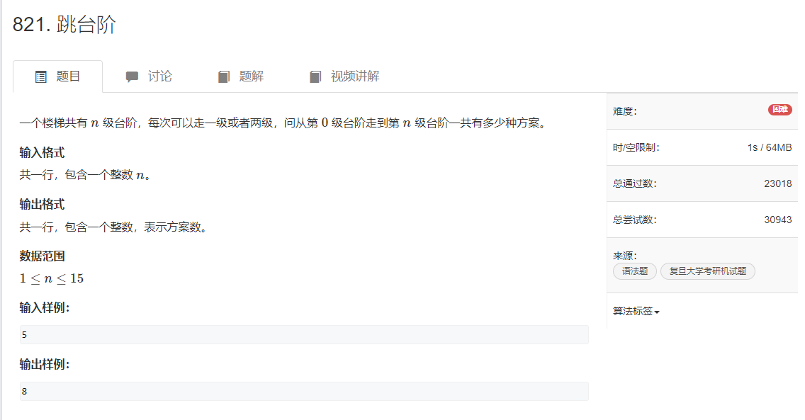
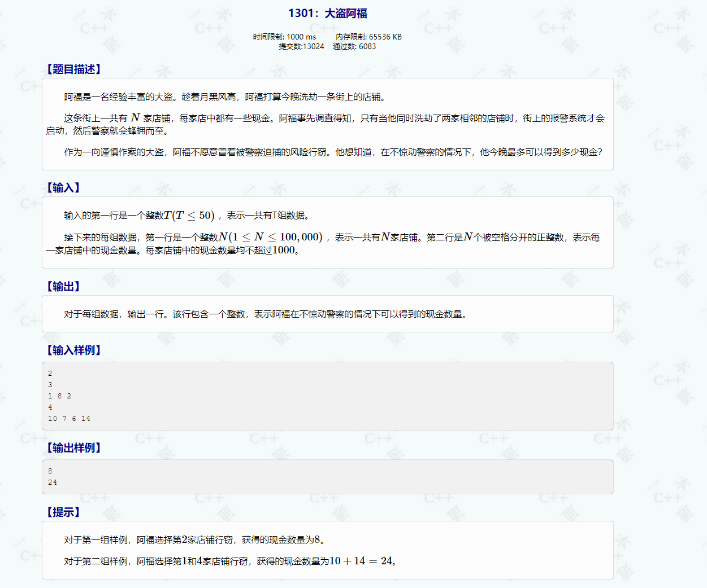

# 动态规划

## 动态规划入门

**动态规划** 就是 : 给定一个问题，我们把它拆成一个个**子问题**，直到子问题可以直接解决。然后把子问题的答案保存起来，以**减少重复计算**。再根据子问题答案反推，得出原问题解的一种方法.

记忆化搜索 = 暴力 dfs + 记录答案

#### **动态规划入门思路**:  dfs暴力 --> 记忆化搜索  --> 递推 --> 优化空间、时间

1dfs > 2记忆化搜索 > 3逆序递推 > **4顺序递推** > 5优化空间

### 递归的过程:

**"递"** 的过程是: 分解子问题的过程;

**"归"** 的过程才是: 产生答案的过程;

**"递"**  ---> **自顶向下**,   **"归"** ---> **自底向上** ， 其中 **"底"** 是 **递归搜索树** 的底

### 写出递推公式的方法: 

**递推** 的公式  = dfs 向下 **递归** 的公式

**递推** 数组的初始值 = **递归** 的边界

#### 例题

[acwing821.跳台阶](https://www.acwing.com/problem/content/823/)  \或者\  [P1255. 数楼梯](https://www.luogu.com.cn/problem/P1255) 

[1301:大盗阿福](http://ybt.ssoier.cn:8088/problem_show.php?pid=1301)  \或者\  [lc198. 打家劫舍](https://leetcode.cn/problems/house-robber/)

[P1216 数字三角形](https://www.luogu.com.cn/problem/P1216) 

[acwing2. 01背包问题](https://www.acwing.com/problem/content/2/) 

**习题**

[P1044 栈](https://www.luogu.com.cn/problem/P1044) 

[P1164 小A点菜](https://www.luogu.com.cn/problem/P1164) 

[P1130 红牌](https://www.luogu.com.cn/problem/P1130) 

用以上思路, 找动态规划的简单题慢慢去写熟练, 熟练之后直接写出递推式即可~

------------

### dp 题单

[LCR 091. 粉刷房子](https://leetcode.cn/problems/JEj789/)  简单  dp

[413. 等差数列划分](https://leetcode.cn/problems/arithmetic-slices/) 如果满足等差，则f[i] = f[i - 1] + 1, 否则为0

[279. 完全平方数](https://leetcode.cn/problems/perfect-squares/) 简单预处理，最后一步：选择某个数作为最后一个

[91. 解码方法](https://leetcode.cn/problems/decode-ways/)  正序dfs好写

[646. 最长数对链](https://leetcode.cn/problems/maximum-length-of-pair-chain/) 最长上升子序列模板 + 排序

[918. 环形子数组的最大和](https://leetcode.cn/problems/maximum-sum-circular-subarray/) 找找最大和 、 最小和 和 总和的关系

[376. 摆动序列](https://leetcode.cn/problems/wiggle-subsequence/) 考虑相邻两个数大小问题，枚举选哪个模型，dp转移可以直接**01转移**

[2786. 访问数组中的位置使分数最大](https://leetcode.cn/problems/visit-array-positions-to-maximize-score/) 枚举每个数选或不选，记录上的数的奇偶性，**01转移** 实现dfs不需要传vector的参数

[213. 打家劫舍 II](https://leetcode.cn/problems/house-robber-ii/) 考虑选不选第一个物品，可以把问题分为两个子问题

[122. 买卖股票的最佳时机 II](https://leetcode.cn/problems/best-time-to-buy-and-sell-stock-ii/) 状态机模型

[368. 最大整除子集](https://leetcode.cn/problems/largest-divisible-subset/) pre数组**记录路径**，更新时实现记录，而不是以前的max不知道更新没更新

[1105. 填充书架](https://leetcode.cn/problems/filling-bookcase-shelves/) 枚举选哪个，**转移方程**有教学意义

[1416. 恢复数组](https://leetcode.cn/problems/restore-the-array/) 枚举选哪个，**集合转移**

[2466. 统计构造好字符串的方案数](https://leetcode.cn/problems/count-ways-to-build-good-strings/) 爬楼梯 

[1043. 分隔数组以得到最大和](https://leetcode.cn/problems/partition-array-for-maximum-sum/) 枚举选哪个，**集合转移**

[2400. 恰好移动 k 步到达某一位置的方法数目](https://leetcode.cn/problems/number-of-ways-to-reach-a-position-after-exactly-k-steps/) 要对mem数组做偏移，`mem[now + N][cnt]` ，选其中一个的思路

[1335. 工作计划的最低难度](https://leetcode.cn/problems/minimum-difficulty-of-a-job-schedule/) 枚举选哪个思路，**集合转移**

[7006. 销售利润最大化](https://leetcode.cn/problems/maximize-the-profit-as-the-salesman/)   **集合转移**， 预处理endi，选或不选

[2008. 出租车的最大盈利](https://leetcode.cn/problems/maximum-earnings-from-taxi/) 选或不选

[1235. 规划兼职工作](https://leetcode.cn/problems/maximum-profit-in-job-scheduling/) 选或不选 	[1751. 最多可以参加的会议数目 II](https://leetcode.cn/problems/maximum-number-of-events-that-can-be-attended-ii/)  类似 [2054. 两个最好的不重叠活动](https://leetcode.cn/problems/two-best-non-overlapping-events/) 

#### 01转移

[376. 摆动序列](https://leetcode.cn/problems/wiggle-subsequence/) 考虑相邻两个数大小问题，枚举选哪个模型，dp转移可以直接01转移

[2786. 访问数组中的位置使分数最大](https://leetcode.cn/problems/visit-array-positions-to-maximize-score/) 枚举每个数选或不选，记录上的数的奇偶性

[122. 买卖股票的最佳时机 II](https://leetcode.cn/problems/best-time-to-buy-and-sell-stock-ii/) 状态机模型

[1186. 删除一次得到子数组最大和](https://leetcode.cn/problems/maximum-subarray-sum-with-one-deletion/) 子数组最大和 + 记录删没删

[2369. 检查数组是否存在有效划分](https://leetcode.cn/problems/check-if-there-is-a-valid-partition-for-the-array/) **划分型dp** 好像用不了记忆化搜索？

[2466. 统计构造好字符串的方案数](https://leetcode.cn/problems/count-ways-to-build-good-strings/) 爬楼梯

# 动态规划反馈：

## 第一节课：

各位家长、同学，晚上好。我是孩子们接下来 C++ 课程的老师，我姓董。

下面我来分享一下我们上节课学习的内容。
分为 1. 上课内容回顾 2. 上课题目回顾 3. 课余时间可以做的事情

1.  上课内容回顾
上节课我们学习了动态规划，动态规划就是 : 给定一个问题，我们把它拆成一个个子问题，直到子问题可以直接解决。然后把子问题的答案保存起来，以减少重复计算。再根据子问题答案反推，得出原问题解的一种方法。动态规划是算法里面比较且重要常用的方法。
动态规划方法：

​		

2. 上课题目回顾
    动态规划前提写建议分四个代码，分别是dfs暴力 --> 记忆化搜索  --> 递推 --> 优化空间、时间（请看下面分享模式参照学习）
    2.1 跳台阶
    题目：

  

  代码：

​		2.2 大盗阿福
​		题目:

​			

​		代码：

3. 课余时间可以做的事情
这部分不作为硬性要求，如果主课学业压力繁忙，把上课写的代码重新复习一下，自己能重新写出来即算合格（不要死记，写代码不是学语文，学会理解）。
如果有时间的孩子，可以把 递归 + dfs(深度优先搜索) ，找B站或者知乎等任何有学习的视频平台看一看。特别是递归，似乎大家还不是很熟练。

以上为上周学习内容，祝大家学业愉快。

下节课内容预告 1.递归 2.dfs（深度优先算法） 

如果大家平时有任何代码上面的问题，或者范围广些，计算机类型问题。随便欢迎大家加我这个号联系我，只要有时间就会回复，如果书面解释不清楚，也可以另开腾讯会议单独投屏讲解。